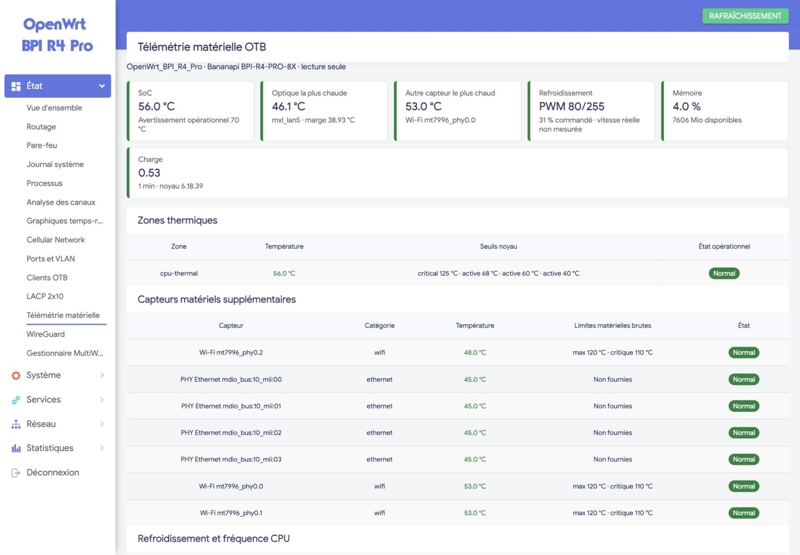

# Télémétrie matérielle OTB pour OpenWrt

`luci-app-otb-telemetry` ajoute une page LuCI **strictement en lecture seule** sous
**État → Télémétrie matérielle**. Elle a été conçue pour les routeurs Banana Pi
BPI-R4/BPI-R4 Pro et pour le switch RTL9303 OTB, tout en conservant un mode de
détection générique.

## Informations affichées

- zones thermiques et seuils du noyau ;
- capteurs `hwmon` : Wi-Fi, PHY Ethernet et autres capteurs disponibles ;
- commande PWM, tachymètre lorsqu'il existe et états `cooling_device` ;
- fréquence CPU, gouverneur et plage autorisée ;
- télémétrie DDM des SFP/SFP+ : température, tension interne du module, courant
  laser, TX, RX, seuils natifs, marges et drapeaux d'alarme ;
- charge, mémoire et historique thermique de 24 heures.

La tension DDM est explicitement présentée comme la tension **du module
optique**, jamais comme l'alimentation générale de la carte.

## Garanties de conception

- aucune écriture dans `network`, `wireless`, `firewall`, les bridges ou les VLAN ;
- aucune commande de ventilation, de fréquence CPU ou de module optique ;
- historique stocké uniquement dans `/tmp` ;
- un échantillon toutes les cinq minutes, 288 échantillons maximum ;
- lecture DDM complète uniquement lorsqu'une page LuCI est ouverte, avec un
  rafraîchissement limité à 30 secondes ;
- ACL LuCI limitée aux méthodes `status`, `sample` et `history` en lecture.

## Cibles vérifiées le 30 juillet 2026

| Cible | Carte | Noyau | Validation |
|---|---|---:|---|
| R4 Pro | BPI-R4-PRO-8X | 6.18.39 | déployé et testé |
| R4 Sud | BPI-R4, deux SFP+ | 6.18.39 | déployé et testé |
| Switch cœur | SODOLA SL-SWTGW3C8F / RTL9303 | 6.18.39 | déployé et testé |
| R4 Nord | BPI-R4 | — | non présent sur le réseau pendant la recette |

Le même paquet est ajouté aux profils d'image BPI-R4 et BPI-R4 Pro. Le code du
paquet est indépendant de l'architecture (`PKGARCH:=all`).

## Fichiers

- `package/custom/luci-app-otb-telemetry/` sur les branches R4, ou
  `package/otb/luci-app-otb-telemetry/` sur la branche du switch : paquet
  OpenWrt ;
- `otb/telemetry/TESTS-20260730.md` : recette et valeurs observées ;
- `otb/telemetry/LIMITATIONS.md` : limites connues, sans les masquer ;
- `otb/telemetry/DEPLOYMENT.md` : intégration d'image, déploiement pilote et
  retour arrière ;
- `otb/telemetry/scripts/` : contrôles et installateur reproductibles.
